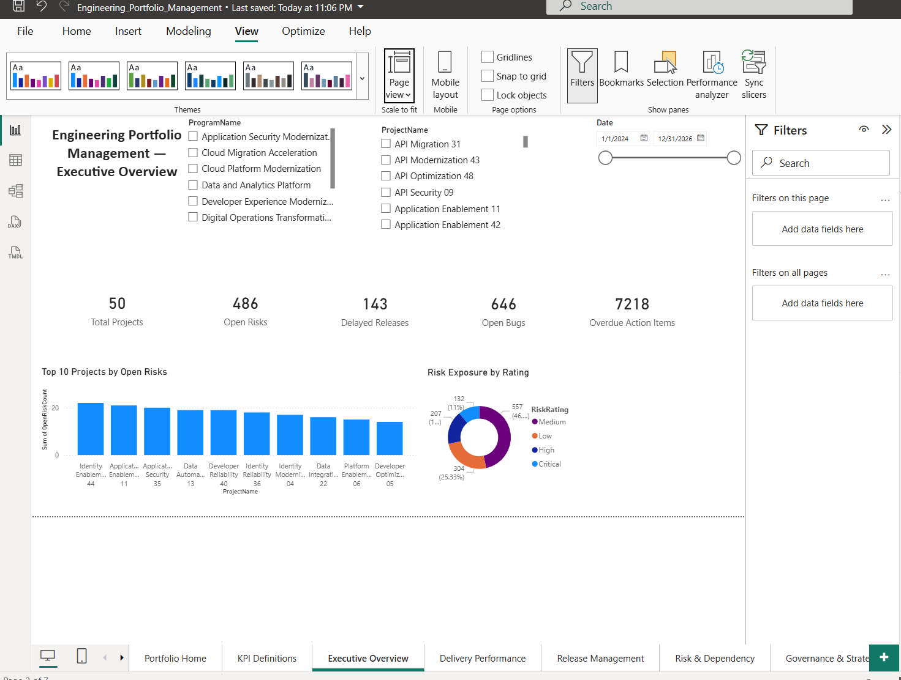
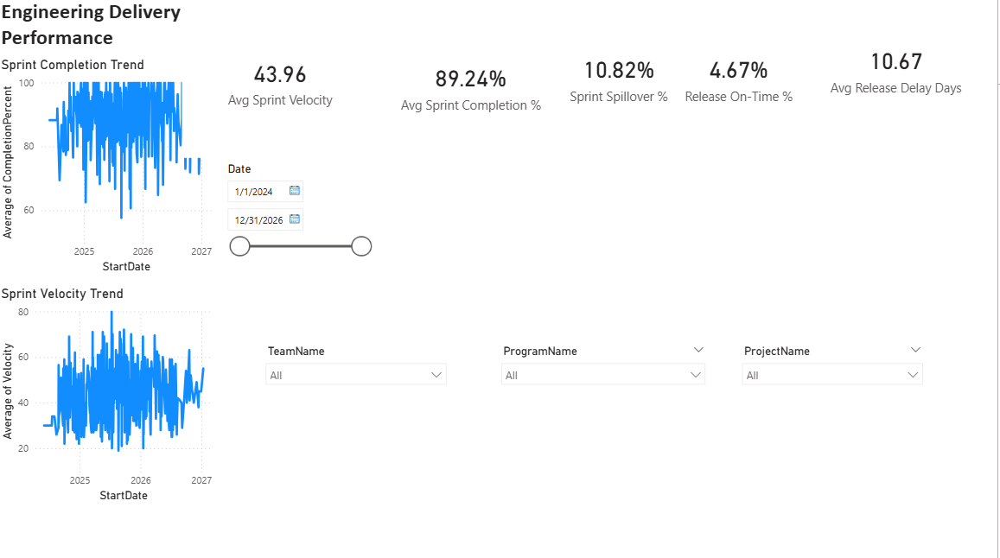
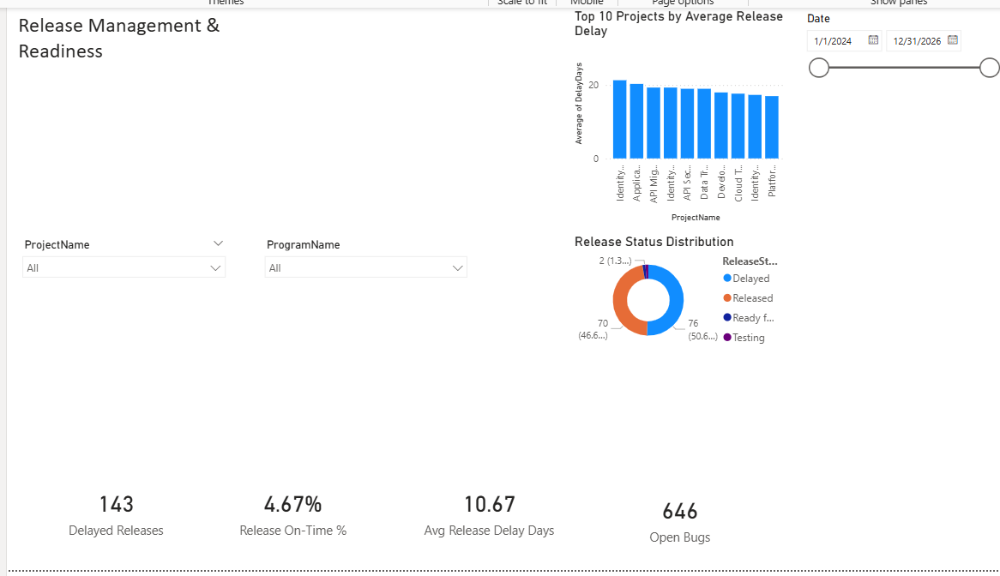
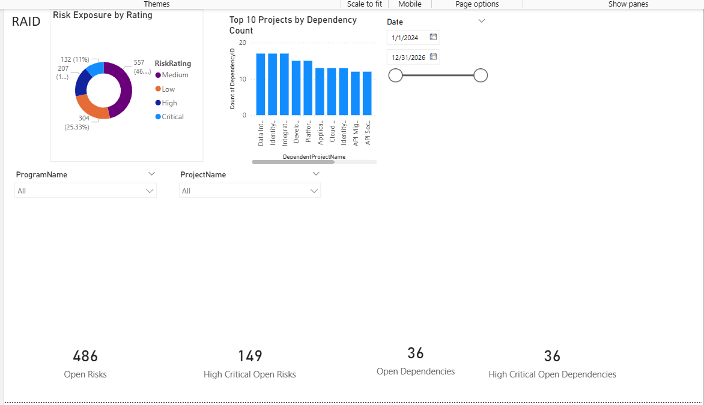
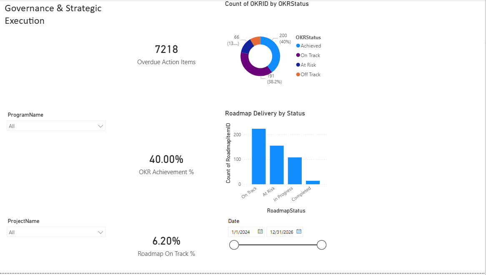

# Engineering Portfolio Management & Delivery Intelligence Platform

An end-to-end, data-driven Technical Program Management analytics platform designed to provide visibility into engineering delivery, release health, risks, dependencies, governance, OKRs, and roadmap execution.

The project simulates a multi-program enterprise engineering organization using synthetic data and demonstrates how a Technical Program Manager can transform operational delivery data into actionable portfolio-level insights.

## Project Objective

Engineering organizations often manage delivery information across multiple systems such as work-item trackers, release pipelines, risk registers, meeting notes, and roadmap tools. This can make it difficult for program leaders to answer fundamental questions such as:

- Are engineering teams delivering sprint commitments predictably?
- Which releases are delayed, and where is schedule risk concentrated?
- Which risks and cross-team dependencies require escalation?
- Is unresolved defect exposure affecting release readiness?
- Are governance action items being completed on time?
- Are roadmap commitments and OKRs progressing as planned?

This project creates a unified engineering portfolio analytics solution to answer those questions using a combination of Python, MySQL, SQL, data modeling, DAX, and Power BI.

## Technology Stack

- **Python** — synthetic enterprise data generation and automated data validation
- **Pandas / NumPy / Faker** — realistic and reproducible portfolio datasets
- **MySQL 8.0** — normalized relational data platform
- **SQL** — schema design, indexing, validation, and analytics views
- **Power BI** — semantic modeling, DAX KPIs, interactive dashboards, and executive reporting
- **Git / GitHub** — source control, documentation, and portfolio presentation

## Solution Architecture

The platform follows an end-to-end analytics pipeline:

```text
Synthetic Enterprise Data
        |
        v
Python Data Generation
(Pandas / NumPy / Faker)
        |
        v
CSV Staging Layer
        |
        v
MySQL Operational Data Store
(19 relational tables)
        |
        v
SQL Analytics Layer
(9 analytics views)
        |
        v
Power BI Semantic Model
(Dimensions + Relationships + DAX)
        |
        v
Executive & TPM Dashboards
        |
        v
Data-Driven Program Decisions

## Enterprise Dataset Scale

The synthetic portfolio is designed to represent the scale and complexity of a multi-program engineering organization rather than a small tutorial dataset.

| Portfolio Entity | Records |
|---|---:|
| Programs | 10 |
| Projects | 50 |
| Products | 25 |
| Engineering Teams | 20 |
| Employees | 250 |
| Stakeholders | 150 |
| Sprints | 500 |
| Epics | 250 |
| Features | 1,000 |
| User Stories | 8,000 |
| Tasks | 25,000 |
| Bugs | 8,000 |
| **Total Work Items** | **42,250** |
| Releases | 150 |
| Risks | 1,200 |
| Dependencies | 500 |
| Meetings | 3,000 |
| Action Items | 10,000 |
| Decisions | 2,000 |
| OKRs | 500 |
| Roadmap Items | 500 |

The data is intentionally correlated to simulate realistic program behavior. For example, capacity constraints can contribute to lower delivery completion and increased spillover, while defects and unresolved dependencies can contribute to release delays, elevated risk exposure, and portfolio health concerns.

> **Data Privacy:** All data in this project is synthetically generated for portfolio and learning purposes. No confidential, proprietary, customer, or former-employer data is used.
## Data Model

The MySQL operational layer contains **19 normalized tables** covering the major domains of engineering portfolio management:

- **Portfolio:** Programs, Projects, Products
- **Organization:** Teams, Employees, Stakeholders
- **Assignments:** Employee-Team, Project-Team, Project-Stakeholder
- **Delivery:** Sprints, Work Items, Releases
- **Risk & Dependencies:** Risks, Dependencies
- **Governance:** Meetings, Action Items, Decisions
- **Strategy:** OKRs, Roadmap Items

Work items use a unified hierarchy:

```text
Epic
 └── Feature
      └── User Story
           └── Task

Bug
```

This enables portfolio reporting while preserving engineering delivery relationships across programs, projects, teams, and sprints.

## SQL Analytics Layer

Rather than connecting Power BI directly to every operational table, the solution includes **9 purpose-built analytics views**:

| Analytics View | Purpose |
|---|---|
| `vw_project_portfolio_health` | Project-level portfolio health indicators |
| `vw_sprint_delivery_performance` | Sprint predictability, velocity, capacity, and spillover |
| `vw_release_health` | Release schedule and readiness analysis |
| `vw_risk_exposure` | Open risk, severity, exposure, and escalation analysis |
| `vw_dependency_exposure` | Cross-project and cross-team dependency visibility |
| `vw_action_item_governance` | Governance action ownership and overdue tracking |
| `vw_okr_performance` | Objective and key-result progress |
| `vw_roadmap_delivery` | Roadmap progress and forecast schedule health |
| `vw_work_item_delivery` | Work-item, defect, and engineering delivery analysis |

This separation creates a clear flow from **operational data → analytics-ready information → business KPIs → management decisions**.

## Power BI Dashboard Suite

The Power BI solution contains five management views designed around common Technical Program Management decision areas.

### 1. Executive Overview

Provides portfolio-level visibility into overall engineering execution.

**Key indicators**
- Total Projects
- Open Risks
- Delayed Releases
- Open Bugs
- Overdue Action Items
- Projects with concentrated risk exposure

**Management question:**  
Where does leadership attention need to be focused across the engineering portfolio?

### 2. Delivery Performance

Analyzes sprint execution and engineering delivery predictability.

**Key indicators**
- Sprint Completion %
- Sprint Velocity
- Sprint Spillover %
- Release On-Time %
- Average Release Delay Days

**Management question:**  
Are teams delivering commitments predictably, and where are delivery trends deteriorating?

### 3. Release Management & Readiness

Provides visibility into release schedule performance and potential readiness concerns.

**Key indicators**
- Delayed Releases
- Release On-Time %
- Average Release Delay
- Open Defects
- Release status distribution

**Management question:**  
Which releases require intervention, and what delivery signals may be contributing to schedule risk?

### 4. Risk & Dependency Management

Surfaces portfolio risks and cross-team/project dependencies requiring coordination or escalation.

**Key indicators**
- Open Risks
- High/Critical Open Risks
- Open Dependencies
- High/Critical Open Dependencies
- Risk exposure by rating
- Projects with concentrated dependency exposure

**Management question:**  
Which risks and dependencies could affect delivery commitments, and where is escalation required?

### 5. Governance & Strategic Execution

Connects execution governance with strategic portfolio commitments.

**Key indicators**
- Overdue Action Items
- OKR Achievement %
- Roadmap On-Track %
- OKR status distribution
- Roadmap delivery status

**Management question:**  
Are governance commitments being closed and strategic objectives progressing as expected?

## TPM Decision Framework

The dashboards are designed around a repeatable program-management workflow:

```text
Detect → Segment → Diagnose → Act → Monitor
```

1. **Detect** — Identify an abnormal KPI or delivery signal.
2. **Segment** — Narrow the issue by program, project, team, release, or time period.
3. **Diagnose** — Examine related signals such as capacity, spillover, defects, risks, and dependencies.
4. **Act** — Coordinate owners, mitigation plans, escalation paths, and delivery trade-offs.
5. **Monitor** — Track whether the intervention improves the relevant delivery outcomes.

KPIs are treated as **signals rather than diagnoses**. The goal of the platform is not merely to report metrics, but to support structured investigation and program-level decision making.
## Portfolio KPI Snapshot

The current synthetic portfolio produces the following baseline indicators:

| KPI | Portfolio Result | Interpretation |
|---|---:|---|
| Sprint Completion | 89.24% | Teams complete most committed sprint scope, while the remaining gap warrants trend and team-level investigation |
| Sprint Spillover | 10.82% | A portion of committed work carries into subsequent sprints |
| Average Sprint Velocity | 43.96 | Useful primarily for observing delivery trends within teams rather than ranking teams |
| Delayed Releases | 143 | A large portion of the synthetic release portfolio is experiencing schedule variance |
| Release On-Time | 4.67% | Indicates an intentionally stressed synthetic release portfolio |
| Average Release Delay | 10.67 days | Adds schedule-delay magnitude to the delayed-release count |
| Open Risks | 486 | Represents active portfolio risk requiring monitoring and mitigation |
| High/Critical Open Risks | 149 | Highlights the subset requiring greater management attention |
| Open Bugs | 646 | Represents unresolved defect exposure across the portfolio |
| High-Severity Open Bugs | 173 | Highlights potentially significant unresolved quality exposure |
| Open Dependencies | 36 | Represents unresolved cross-project or cross-team coordination points |
| Overdue Action Items | 7,218 | Indicates significant governance follow-through pressure in the synthetic portfolio |
| OKR Achievement | 40.00% | Measures the proportion of modeled OKRs meeting their target |
| Roadmap On Track | 6.20% | Indicates substantial forecast pressure in the intentionally stressed roadmap dataset |

> These values describe a **synthetically generated and intentionally stressed engineering portfolio**. They are not industry benchmarks and should not be interpreted as recommended performance targets.

## Example Analytical Investigation

A KPI is used as the beginning of an investigation rather than the final conclusion.

For example:

```text
Sprint Completion declines
        ↓
Check Spillover and Capacity
        ↓
Review Team / Project segmentation
        ↓
Inspect Bugs and Dependencies
        ↓
Assess Release Delay
        ↓
Review Risk and Roadmap impact
        ↓
Assign mitigation actions
        ↓
Monitor subsequent delivery trends
```

This approach helps distinguish between a **delivery signal** and its possible contributing factors. It also avoids assuming causation from a single KPI.

## Repository Structure

```text
engineering-portfolio-management/
│
├── python/
│   ├── config.py
│   ├── generate_delivery_data.py
│   ├── generate_governance_data.py
│   ├── load_mysql_data.py
│   └── validate_raw_data.py
│
├── sql/
│   ├── 01_create_schema.sql
│   ├── 03_create_indexes.sql
│   ├── 04_validation_queries.sql
│   ├── 05_create_analytics_views.sql
│   └── 06_create_powerbi_user.sql
│
├── data/
│   ├── raw/
│   ├── processed/
│   └── exports/
│
├── powerbi/
├── docs/
├── images/
│
├── requirements.txt
├── .gitignore
└── README.md
```

Generated datasets, local Power BI files, development backups, virtual environments, and credentials are intentionally excluded from source control.

## Reproducible Data Pipeline

The project is designed so that the portfolio data can be regenerated rather than storing large generated datasets in GitHub.

### 1. Install Python Dependencies

```powershell
pip install -r requirements.txt
```

### 2. Generate Synthetic Delivery Data

```powershell
python -m python.generate_delivery_data
```

### 3. Generate Governance & Strategic Data

```powershell
python -m python.generate_governance_data
```

### 4. Validate the Generated Data

```powershell
python -m python.validate_raw_data
```

The validation layer checks dataset volumes, key uniqueness, referential integrity, hierarchy consistency, cross-domain relationships, and business/date rules.

### 5. Create the MySQL Analytics Platform

Execute the SQL scripts in sequence to:

1. Create the relational schema.
2. Create performance indexes.
3. Validate loaded data.
4. Create the analytics views.
5. Create a read-only Power BI database user.

### 6. Load Data into MySQL

```powershell
python -m python.load_mysql_data
```

Database credentials are requested at runtime and are not stored in the source code.

### 7. Connect Power BI

Power BI connects to the MySQL analytics layer using a read-only account and imports the purpose-built analytics views for semantic modeling and dashboard development.

## Security & Source-Control Practices

- No production or former-employer data is used.
- All portfolio data is synthetic.
- Database passwords are not stored in source code.
- The Power BI database account uses read-only access.
- Local environment files and secrets are excluded through `.gitignore`.
- Generated datasets and development backup files are excluded from the public repository.
## Skills Demonstrated

This project demonstrates practical capabilities across Technical Program Management, engineering analytics, and data-driven decision support:

- Engineering portfolio and program management
- Agile and sprint delivery analytics
- Release planning and readiness tracking
- Risk, dependency, and escalation management
- KPI and OKR measurement
- Roadmap and strategic execution tracking
- Governance and action-item management
- Python-based data generation and validation
- Relational data modeling with MySQL
- SQL analytics and data-quality validation
- Power BI semantic modeling and DAX
- Executive dashboard design
- Cross-functional engineering data analysis
- Git and GitHub source control

## Future Enhancements

Planned extensions include:

- Resource capacity and utilization analytics
- Budget and financial tracking
- Executive PMO reporting in Excel
- Automated portfolio health scoring
- Historical project-health snapshots
- Enhanced release-readiness indicators
- AI-assisted risk and dependency insights
- Meeting and action-item summarization
- Natural-language portfolio analytics
- AI-enabled Engineering Program Management Copilot

## Project Status

**Current:** Core data platform, validation framework, MySQL analytics layer, Power BI semantic model, and five dashboard modules completed.

**Next:** Dashboard visual polish, portfolio screenshots, enhanced documentation, and AI-enabled program-management capabilities.

## Dashboard Gallery

### Executive Overview



### Delivery Performance



### Release Management & Readiness



### Risk & Dependency Management



### Governance & Strategic Execution

